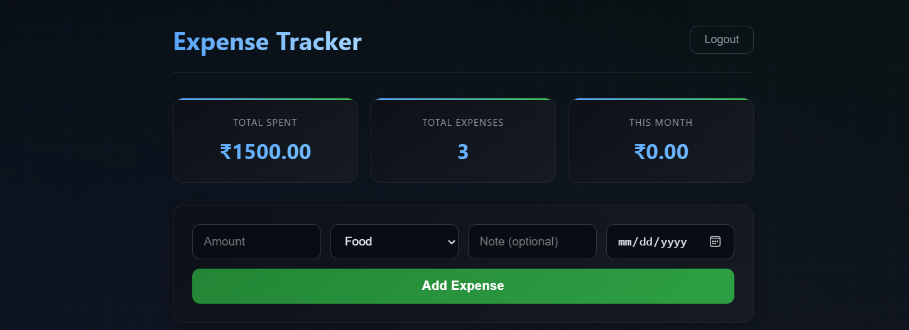
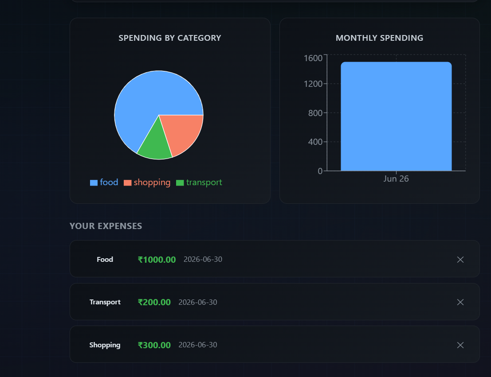

# Expense Tracker with Analytics Dashboard

A full-stack web application for tracking personal expenses with real-time analytics. Built with Django REST Framework and React, featuring JWT authentication, PostgreSQL database, and interactive charts.

📁 **GitHub:** https://github.com/vunnam-sirisha19/expense-tracker

---

## Screenshots

### Login Page


### Dashboard





---

## Features

- 🔐 **JWT Authentication** — secure register, login, and logout
- ➕ **Expense Management** — add, view, and delete expenses with category, amount, date, and note
- 📊 **Analytics Dashboard** — interactive pie chart (spending by category) and bar chart (monthly trend)
- 💰 **Stats Summary** — total spent, total expenses count, and this month's spending at a glance
- 🎨 **Modern Dark UI** — animated gradient background, floating orbs, frosted-glass cards, color-coded category pills
- 🔒 **Per-user Data** — each user only sees their own expenses, fully isolated

---

## Tech Stack

**Backend**
- Django 5.x
- Django REST Framework
- djangorestframework-simplejwt (JWT auth)
- PostgreSQL + psycopg2
- python-decouple (environment variables)

**Frontend**
- React 18
- React Router DOM (multi-page routing)
- Axios (API calls with JWT interceptor)
- Recharts (pie chart + bar chart)

---

## Project Structure

```
expense-tracker/
├── backend/
│   ├── accounts/        # User registration and JWT auth
│   ├── expenses/        # Expense model, serializer, CRUD API
│   └── backend/         # Django settings, URLs
├── frontend/
│   └── src/
│       ├── pages/
│       │   ├── Login.js
│       │   ├── Register.js
│       │   └── Dashboard.js
│       ├── api.js       # Axios instance with JWT interceptor
│       ├── App.js       # Routing and auth state
│       └── App.css      # Global styles
└── .gitignore
```

---

## How It Works

1. User registers or logs in — Django issues a JWT access + refresh token pair
2. React stores tokens in localStorage and attaches them automatically to every API request via an Axios interceptor
3. Django validates the token on each request and only returns that user's own expenses
4. The dashboard fetches expenses on load, calculates category totals and monthly totals, and renders them as charts using Recharts

---

## Running Locally

### Prerequisites
- Python 3.11+
- Node.js 18+
- PostgreSQL 16+

### Backend Setup
```bash
cd expense-tracker
python -m venv venv
venv\Scripts\activate       # Windows
pip install django djangorestframework djangorestframework-simplejwt psycopg2-binary django-cors-headers python-decouple
```

Create a `.env` file in the root folder:
```
DB_NAME=expense_tracker
DB_USER=postgres
DB_PASSWORD=your_password
DB_HOST=localhost
DB_PORT=5432
```

```bash
cd backend
python manage.py migrate
python manage.py runserver
```

### Frontend Setup
```bash
cd frontend
npm install
npm start
```

Visit `http://localhost:3000` — register a new account and start tracking expenses.

---

## API Endpoints

| Method | Endpoint | Description |
|--------|----------|-------------|
| POST | `/api/auth/register/` | Register a new user |
| POST | `/api/auth/login/` | Login and get JWT tokens |
| GET | `/api/expenses/` | List all expenses (authenticated) |
| POST | `/api/expenses/` | Create a new expense |
| DELETE | `/api/expenses/{id}/` | Delete an expense |

---

## What I Learned

- Building JWT authentication from scratch with Django REST Framework and simplejwt
- Using Axios interceptors to automatically attach auth headers to every request
- Connecting Django to PostgreSQL and managing migrations
- Building multi-page React apps with React Router and protected routes
- Transforming raw expense data into chart-ready formats for Recharts
- Handling auth state in React so protected routes redirect correctly
- Managing CORS between a Django backend and React frontend

---

## Future Improvements

- Edit expense inline (click to update amount/category/date)
- Filter expenses by category or date range
- Export expenses to CSV
- Monthly budget limits with alerts when approaching limit
- Deploy backend on Render, frontend on Vercel
